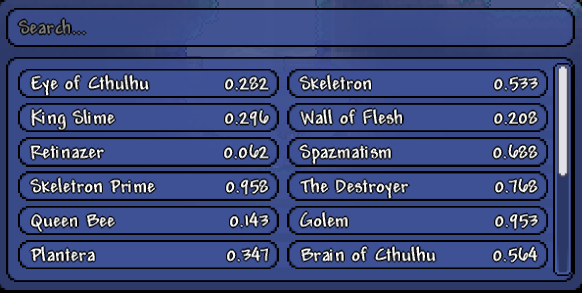

# Terraria Gear Quality Calculator (TGQC)

A tModLoader mod that calculates **Survivability Ratio (SR)** for boss fights to help optimize your gear choices.

**Survivability Ratio (SR)** is a metric that answers: *"How good is my current gear against this boss?"*

The concept is simple: **kill the boss faster than it kills you.**

## Concepts

SR = **Player Survival Time** / **Boss Survival Time**

where:

- **Player Survival Time**: How long you can survive against the boss's damage (your HP / boss DPS)
- **Boss Survival Time**: How long it takes you to kill the boss (boss HP / your DPS)

Interpretation of the values:

- **SR ≥ 1.0**: you will have more winning attempts in average
- **SR < 1.0**: more losing attempts in average

Higher SR means better gear for that specific boss. This lets you compare builds objectively, examples:

- Glass cannon (high damage, low defense) vs. tank (high defense, low damage)
- Trading +15% damage for +30 defense
- Choosing between +7% damage or +25% damage reduction on low health

### Example

You're fighting Moon Lord with 500 HP:

- Your DPS: 1000
- Boss HP: 145,000
- Boss DPS against you: 50

**Calculations:**

- Boss Time = 145,000 / 1,000 = 145 seconds
- Player Time = 500 / 50 = 10 seconds
- **SR = 10 / 145 = 0.069** (you lose badly)

After swapping to defensive accessories:

- Your DPS drops to 800
- Boss DPS against you drops to 25

**New calculations:**

- Boss Time = 145,000 / 800 = 181 seconds
- Player Time = 500 / 25 = 20 seconds
- **SR = 20 / 181 = 0.110** (still losing, but 60% better!)

## Features

- Tracks boss fight statistics (DPS, fight time, health)
- Calculates SR after each boss attempt (loss or victory)
- Records player gear (weapons, accessories, armor) during fights
- Stores fight history with JSON persistence
- Supports both vanilla and modded bosses (Calamity, Fargo's Souls, etc.)
- In-game UI to view SR and gear for each boss encounter

### Current Limitations

- **Single-player only** - multiplayer support not implemented
- **Trivial calculation mode** - uses basic DPS/health/time formula
- No predictive gear comparison yet (requires complex analysis implementation)
- Heavily relies on hit frequency and luck, causing SR to vary wildly between identical attempts (e.g., 0.427 to 1.514
  with the same gear). This makes results unreliable for gear comparison.

**"Skill matters more than gear".** Hit frequency reduced by a few seconds will increase your survivability better than
end game accessories.

See [full technical specification](https://docs.google.com/document/d/1z0iCaLS2VnLF_9YpYenj_USG7RHCrP59tK6sey5r23I/edit?usp=sharing)
for detailed analysis and proposed solutions.

## Installation & usage

1. Install [tModLoader](https://github.com/tModLoader/tModLoader/releases)
2. Clone this repo locally with `git clone`
3. Place the directory in `Terraria/tModLoader/ModSources`
4. Enable the mod via _Develop mods_ menu in tModLoader.
5. Set up the hotkey in _Controls_ section of _Settings_ and press it to open GUI.
6. Fight a boss and see what happens.
